# User Modifications in Linux

## This file list linux commands to add and mpdifiy users and groups as well as pictures showing execution of these commands

### 1. Create a group with the following options:
- groupname: work
- gid: 1010

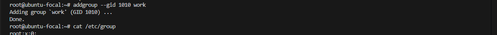

### 2. Create a user with the following options:
- username: samson
- home: /home/samson
- shell: /bin/sh
- user ID: 1005
- group: work
- gecos (fullname, room number, work phone, home phone): "Samson Bryan,36,123-456-789, 456-789-101"

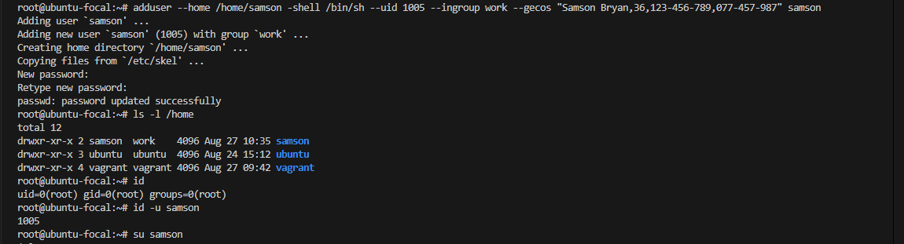

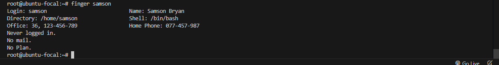

### 3. Change user 'samson' login shell to /bin/bash

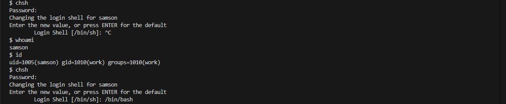

### 4. Create another user with the following options:
- username: peter
- gid: 1010
- no home directory
- disable password
- gecos (fullname, room number, work phone, home phone): "Peter Kyle,37,234-678-989,,"

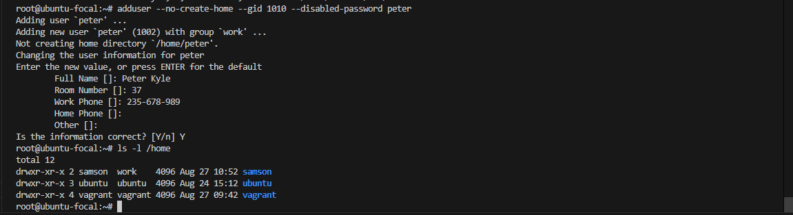
  
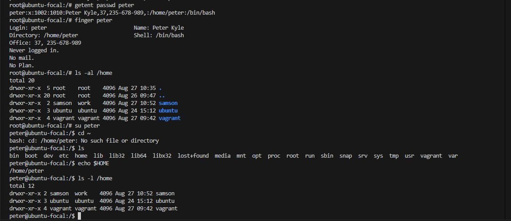

### 5. Create group with the following options:
- groupname: finance
- gid: 1011

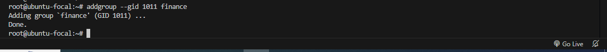

### 6. Create another user with the following options:
- username: john
- group: finance
- disable login
- gecos (fullname, room number, work phone, home phone): "John Doe,38,345-678-989,,"

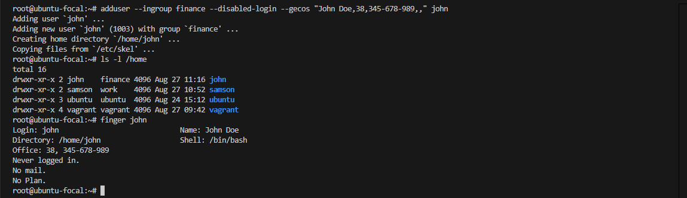

### 7. Create a user with the following options:
- username: paul
- gid: 1010
- encrypt home directory

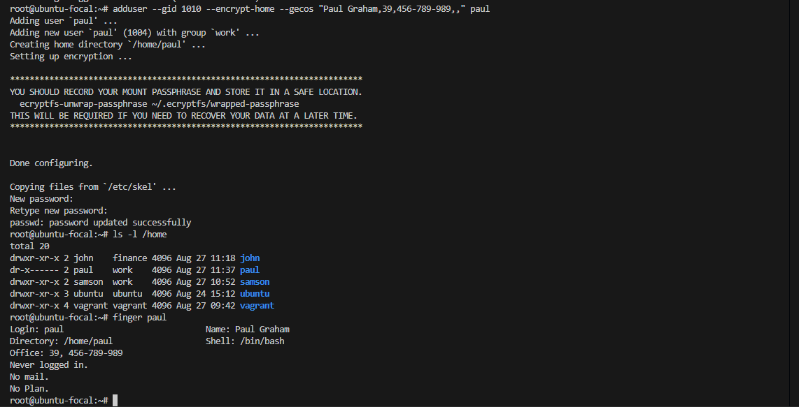

### 8. Add users samson & paul to the finance group

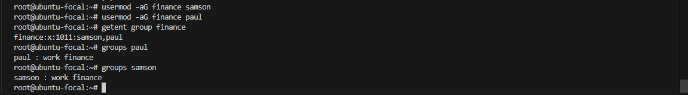

### 9. Create group 'marketing', add paul to marketing, delete group marketing

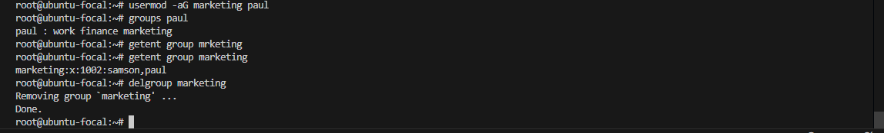

### 10. Prompt paul to change his password
- add an expiry date to paul's account
- edit the maximum number of days between paul's password change to 5
- add a warning for paul to change his password from day 4

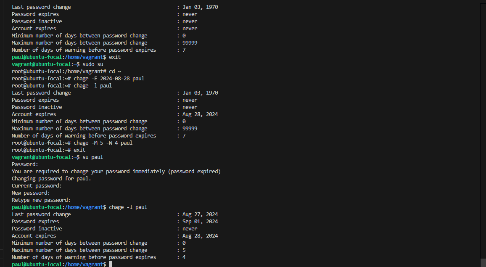

### 11. Enable members of work group to only run cat on /etc

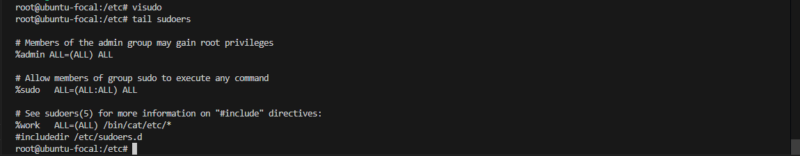
